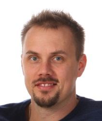

# Anders Lundsgård

## Summary

Experienced Cloud Solution Architect with 10+ years of passion for implementing DevOps practices at Scania. He has made the journey from Monolithic applications to Microservices, On-Premise hosting to Public Cloud and from 3 production deployments per year to 30+ per day.  

During the 12 years at Scania, he has faced challenges that exists within silo structured organizations. Humility and patience have been key factors to get developers, operations and business people involved in the improvement work.  

With a combination of deep dive technical skills and the ability to drive and follow strategic decisions, he has become an advisor for engineers as well as to upper management at Scania. Within Scania’s Cloud journey, he onboard new teams to AWS, drives Well-Architected Workshops, and develop security guardrails for Scania’s AWS and Azure Cloud foundation.  

He is an international speaker that enjoy to share successes and failures related to Architecture, DevOps and Cloud.  

He is the founder and drives https://devops.vision

### Short version

*I am a software craftsman and leader with a passion for Cloud and DevOps. With Continuous Integration and Continuous Delivery, I help companies to produce high-quality code in very short iterations. Defining and implementing DevOps practices along with Cloud computing is my primary mission.*

## Personal Information

A father of two and a husband of one. Living with my family in Nykvarn. Having the golf clubs and the black belt in taekwondo on the shelf, they will surely come in handy sometime in the future. Besides being with my family I like running, formula 1 and melodifestivalen.

## Projects

### Cloud Solutions Architect
**Period**: 2018.12 -> *current*  
**Department**: Cloud Center of Excellence  

He is a member of the Cloud Security team at Scania Cloud Adoption (CoE). Managing 500+ Cloud accounts and supporting 100+ developer teams with their greenfield and migration challenges to AWS and Azure public Clouds.  

The mission is to enable teams stay continuous compliant to security policies (DevSecOps). Automation and Infrastructure as Code is key to keep Scania’s Cloud foundation stable and with ability to evolve according to developer teams demands. Defining the shared responsibility model between Cloud Adoption and autonomous DevOps teams.  

With his experience from previous missions as developer and software architect, he frequently advocates DevOps practices around the organization.

### Cloud and Delivery Engineer
**Period**: 2015.07 -> 2018.11  
**Department**: Scania Connected Services  

He and his team were pioneers at Scania to bring the first large application into public Cloud (Azure) in 2015. With very high demands of availability and an increasing volume of connected vehicles, he was one of the drivers for the Cloud first decision at Scania in 2016. He presented Scania’s Cloud and DevOps journey at AWS Summit in 2017.  

Together with three awesome colleagues he won the Scania Innovation Challenge in 2017.   

### Solution Architect
**Period**: 2010.12 -> 2015.06  
**Department**: Scania Connected Services  

Early 2010 he implemented Continuous Integration practices among 20+ developer teams at Connected Services. Along with facing technical and cultural challenges he led the re-architecture of a large monolithic .NET application, to smaller 100+ independent deployable services. During this transformation he also was responsible leading a team with mission to evolve a brand new frontend portal for fleet management customers. This with limited abilities for automation on a static on-premises infrastructure.  

Within 5 years, Scania Connected Services managed to improve from 3 production deploys per year to 30+ per day.

### Developer & Release Engineer
**Period**: 2008.05 -> 2010.11  
**Department**: Scania Connected Services    
*to come...*
